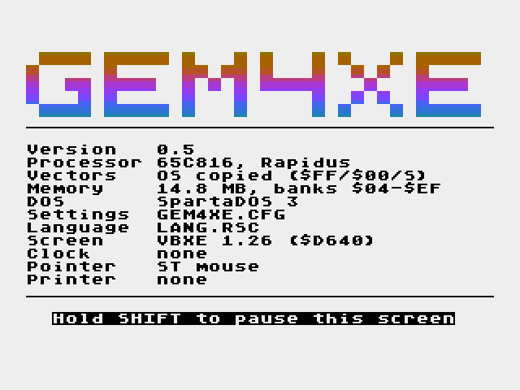

# gem4xe — GEM for the Atari 8-bit

A port of GEM — the VDI graphics layer, then the AES — to an Atari XL/XE fitted
with **VBXE** (video), a **65C816 accelerator** with linear RAM (**Rapidus**, and
in principle Antonia), and **Ultimate 1MB**.

The target surface is **640 × 240, 16 colours** — VBXE's HR overlay, 4bpp chunky.
That is a better GEM surface than the Atari ST's medium resolution.

Current version **0.6.1** — `VERSION` at the top of the tree is where it
lives; `make dist` stamps a build with it and the commit, and `make
release` is the same for the public, without the DOS 2 floppy (its DOS is
not gem4xe's to give away) and named by the version alone.

**A 65C816 with linear RAM is required.** VBXE is not: one `GEM.COM` carries
both display drivers and chooses at start-up, so a machine without a VBXE gets
320×168 on ANTIC mode F instead — `make test-m26` boots the shipped binary three
ways to prove it. The 6502 path is still deferred.

The desktop first came up on a real board on 2026-09-13 — a 130XE with a
Rapidus, an Ultimate 1MB, a VBXE and a SIDE 2 — after two reports that did
not get there: a white screen (`docs/phase39.md`), then a boot screen that
stopped at its **Vectors** line (`docs/phase40.md`). That line says
what the machine found under its OS ROM, how the Rapidus was set up and which
RAM under the ROM took the interrupt vectors, and `make
diag` builds `GEMDIAG.COM` — `GEM.COM` with a digit and a tone per start-up
step and OPTION/SELECT/START to skip and single-step — for a machine with no
emulator bridge to ask.

## Pictures

The product booted and used, photographed under AltirraSDL by `make shots`
(`tests/emu/shots.py`, which reads its coordinates out of the running
desktop's own object trees). Every picture is 640 × 480: the 640 × 240
overlay with its rows doubled, which is what a monitor shows.

The rest are in [`docs/shots/`](docs/shots/): the bare desk, the Desk and
File menus, the About box, a folder in icon and text view, Show Info, and
the three desk accessories — the control panel, the calculator and the
clock — each open over a window. Two of them are taken from *inside* the
control panel, which is the point of the shape: the panel lists what the
AES loaded and calls a module's entry, so what is photographed is a
dialog belonging to a separately linked file the panel has never heard
of — one a settings CPX, one an event CPX being fed events by a host
that owns the loop.

## Why it is shaped the way it is

VBXE sits on the 1.79 MHz chip bus no matter how fast the CPU runs. Measured on
target, a full-screen fill costs 0.51 of a frame through the blitter and a
full-screen copy 0.88; the same work through the MEMAC window is roughly twenty
times slower. So **the VDI emits blitter control blocks, it does not plot
pixels**, and the window manager will use dirty rectangles rather than
full-screen repaints.

## State

| Gate | | |
|---|---|---|
| `make test-host` | 285/285 | pointer device layer — the ST, Amiga and CX80 models walked through the target's C in the compiler's simulator — .xex far-code staging, and the application bindings: every one of them called in the simulator with the three call gates replaced by recorders, and the parameter block each builds compared with the VDI and AES contracts; the application kit, assembled and built out of a copy of itself in a directory of its own; the far allocator, asked for the blocks that used to straddle a bank; and the distribution, built both ways, with the release checked for the floppies it must not carry and for what its page says instead |
| `make test-emu` | 5/5 | VBXE FX 1.26 / Rapidus / MEMAC A / CPU switch |
| `make test-m1` | 5/5 | Calypsi C on the 65C816 |
| `make test-m2` | PASS | 640×240×4bpp HR overlay, 153,600/153,600 pixels |
| `make test-m3` | 86/86 | VDI conformance — pixels *and* return values |
| `make test-m4` | 15/15 | AES object library: draw, find, change, edit, centre, icons — mono, and colour icons drawing their mono form — and the tree surgery an application does at run time — `objc_add` and `objc_delete` through every defined branch of the child chain (a middle child, the head, the tail, the last one left, a first child again, and the root refusing to go), checked in the tree's own memory as well as on the screen |
| `make test-m5` | PASS | linear RAM probed on a **Rapidus**: banks `$04-$EF`, 14.8 MB |
| `make test-m5p` | PASS | the same probe on a **plain 65C816** with high banks and no accelerator — the shape of an Antonia, and the proof that nothing here depends on one board. Needs this tree's AltirraSDL fork (`tools/altirra/altirra-sdl-cpu-highbanks.patch`) |
| `make test-m6` | PASS | far code copied up and running from the banks the linker chose — bank `$01`, and `$01`+`$02` in a forced-spill link; bank `$00` on the fast bus |
| `make test-m7` | 10/10 | `evnt_*`, `form_do`, `form_dial`, `graf_watchbox` under host-driven input |
| `make test-m8` | 12/12 | the window manager and the control manager: rectangle lists, moves, gadgets, `WM_*` |
| `make test-m9` | 4/4 | menus: the bar, drop-downs, `MN_SELECTED`, screenshotted inside the wait |
| `make test-m10` | 28/28 | native-mode interrupts: the OS shadowed into SRAM byte for byte, the VBI, a ~4 kHz timer, the keyboard, a trak-ball counted under interrupt, and a clean return to DOS |
| `make test-m11` | PASS | the application ABI: a separately linked program loaded, relocated and run, calling the VDI and the AES through `COP` — its records, the loader's, and the screen against the reference |
| `make test-m12` | PASS | the file layer: CIO through the OS in emulation mode, `rsrc_load`/`rsrc_obfix` — of a **new-format resource**, its colour-icon extension streamed to far memory and the one near record per icon compared byte for byte, the far heap back where it was after the free — `shel_*`, **the clipboard** (`scrp_read`/`scrp_write`, the scrap directory kept by the AES in far memory, round-tripped), `Tgettimeofday` and `clock()` from a program, and the file selector driven over two disks — its listings, its scrolling and its returned strings against the reference, pixel for pixel. The **scrap manager** rides here too, being the other thing the AES keeps for applications rather than itself: an empty path from a fresh AES, a directory written and read back, a second write replacing the first, and a 203-byte path coming back cut to 127 and NUL-terminated |
| `make test-m13` | 19/19 | alerts, icons and the pointer: `form_alert` parsed, laid out and drawn against the reference; every mouse form `graf_mouse` owns, and the caller's own |
| `make test-m14` | PASS | SpartaGEM on SpartaDOS 3.2: the DOS identified behind CIO, paths mapped into its `>` syntax, files read through subdirectories, and the file selector walked into a folder and back out -- listings and strings against the reference, pixel for pixel |
| `make test-m14x` | PASS | the same on SpartaDOS X 4.50, the cartridge -- with the application pool and the test stage moved out of its way, into the banked window it services calls from |
| `make test-m15` | PASS | GEMDOS: the ST's trap #1 as gem4xe's third `COP` face, answered from CIO and the DOS seam -- directory searches, paths, files, far memory, attributes and errors, every answer against the disk image; and the four calls that used to be holes (`docs/phase16.md`): `Dfree` exact from the file system's own count rather than three characters of a listing, `Fseek` through all three modes, `Fdatime` without disturbing a search, `Tgetdate`/`Tgettime` off the Ultimate 1MB's DS1305 — `test-m15x` on SpartaDOS X, `test-m15d` on DOS 2, `test-m15u` on the U1MB machine, where the clock is compared with the host's own |
| `make test-m16` | PASS | the shell loop: DESKTOP.PRG loaded and run, a program run from it and the desktop back, a missing program's alert, shutdown -- the screen against the reference at each stop, the pool and the far heap back where they were, the stack's low-water mark (1199 of 2048 bytes); the VDI's virtual workstations (one per program) under it. GEM.COM, the product, does the same from the DOS prompt and returns to it |
| `make test-m17` | PASS | the GEM Desktop: DESKTOP.PRG's menu bar, drive icons and trash, an icon clicked, Desk -> About and its dialog, a drive opened into a folder window, a folder opened in it and closed back out, the fuller, the arrows, the closer, File -> Quit -- driven at the mouse and checked against `tools/deskref.py`, the desktop itself transcribed against the AES model, its directory listings answered from the disk image: eighteen screens, the desktop's 2070 bytes of globals byte for byte at fourteen of them, 421 calls on both sides, the pool and far heap back, the runner's and the desktop's stack low-water marks (1660 of 2048, 399 of 640) |
| `make test-m18` | PASS | a program run from the desktop: drive A opened, the window full, M11.PRG double-clicked -- the desktop puts its window's place in the shell buffer as DESKTOP.INF text and exits, the shell runs the program, the desktop comes back and opens the window where it was, File -> Quit -- the desktop transcribed twice against one AES model with the program's calls counted between: six screens, `G` at four waits, 299 calls over the three programs, the pool and far heap back, each run's stack low-water mark (515 and 323 of 640) |
| `make test-m19` | PASS | the desktop's writes to a disk: File -> New folder, the name typed into its dialog, `Dcreate`, the folder in the listing; the same name again, refused, and the alert -- text and all -- out of DESKTOP.RSC's free strings; an item dragged into the new folder and copied there, the walk a DTA deep per level; the window fulled and File -> Show info on the folder -- what it holds, counted -- and then on a file, whose extension is edited in place and whose OK renames it (`Frename`); the SUB tree selected and File -> Delete, counted first, confirmed in a dialog whose counts tick down, and the tree gone; then Options -> Save desktop and Options -> Read .INF file, the layout written to `DESKTOP.INF` and read straight back with the windows closed and opened again from it -- seventeen screens, `G` at ten waits, 605 calls on both sides, and the disk image itself read back afterwards, the INF included |
| `make test-m20` | PASS | what the system says comes off the disk: `form_error` on three disks — the product's `LANG.RSC`, a German translation of it, and no file at all — each compared with the model given the strings that disk carries, so the first and third draw the same screen and the second draws the translation |
| `make test-m21` | PASS | a loadable font: the system font inverted so every glyph differs, read as `SYSTEM.FNT` at start-up off one disk and absent from another, with `vqt_name`, `vst_font` and GDOS's `vst_load_fonts`/`vst_unload_fonts` answering for the right face either way |
| `make test-m22` | PASS | two programs that are not tests: a calculator driven at its keypad and a clock left to tick, both through the shell loop |
| `make test-m23` | PASS | a program opened from a folder and used — the path a person took that eight gates had not |
| `make test-m24` | PASS | the ANTIC surface: mode F at 320×168 in the region the VBXE's MEMAC window would have had, 53,760/53,760 pixels against `tools/anticref.py`, two colours and no palette hardcoded |
| `make test-m25` | PASS | the VDI **and the AES object library** on that surface — the same `src/vdi/vdi.c` the VBXE build links, on Atari's condensed 6×6 face, with an OUTLINED dialog and its DEFAULT button drawn by `ob_draw`: 53,760/53,760 pixels against `tools/vdiref.py` and `tools/aesref.py` themselves, run on the ANTIC device with one argument changed; and the geometry `gsx_start` derived, checked by doing the AES's own arithmetic rather than by comparing numbers somebody wrote down |
| `make test-m26` | PASS | **one binary, two screens**: the shipped `GEM.COM` booted three ways with nothing typed — with a VBXE, without one, and with `VIDEO=ANTIC` in `GEM4XE.CFG` against a VBXE that works — checking which device the VDI ended on, what the AES laid out for, what the file parsed to, and the desk itself **pixel for pixel against `tools/deskref.py` run on the ANTIC device** — the same desktop model `test-boot` compares the VBXE desks against |
| `make test-m27` | PASS | **two contexts taking turns on one engine stack** — the turns in the order they were asked for, and a context that recurses six frames and yields from the deepest one finding every local intact on the way back out, which is the whole claim the design rests on: a parked extent goes back to the same addresses. Prints what a park cost: 90 bytes at the deepest |
| `make test-m28` | PASS | **a desk accessory resident beside the desktop** — loaded before it, registered in the Desk menu, and its own timer still advancing while the desktop owns the mouse. The drop-down is checked against the object tree rather than a screenshot; the menu is then pulled down with the mouse and the `AC_OPEN` read word for word out of the accessory, and `File → Quit` delivers the `AC_CLOSE` — after which the accessory is still there, which is the whole difference between an accessory and a program |
| `make test-m29` | PASS | **an application with more data than bank `$00` has** — linked `--data-model=large`, its variables in a far bank of their own, loaded by the shell and run: the far bss zeroed, the far initialisers copied up by the crt's own table, a 40 KB array walked end to end, and its strings where they lie — a **far window title** the AES brings down where it draws it, a 102-byte far alert string through the pool. The `.G4A` header's far-bank count comes from the linker's map, because a far bss carries no bytes and sizing it from the image would ask for one bank too few |
| `make test-m30` | PASS | **the VDI on a printer** — the third device through the seam and the first that is not a screen: 640×800 dots in one far bank, drawn by the same `vdi.c`, written out by `v_updwk` as PCL 5 and as PostScript, both files read back out of the disk image. The PCL is decoded back to a page and compared with `vdiref` on `devref.Printer` — all 512,000 dots — and the Atari's own **PostScript is rendered by Ghostscript** and compared with the same page, which is what checks the y-flip and the DeviceGray inversion |
| `make test-m31` | PASS | **an application whose far image is bigger than a bank** — GACS's GEM shell, 100 KB of far code and another 11 KB of constants, loaded, relocated across banks and run. Two limits had been sitting behind that and neither would have announced itself: the far fixup offsets were 16-bit, so an address past `$FFFF` of the image could not be named at all, and `tools/mkg4a.py` refused a multi-bank image up front — a refusal guarding an invariant the packer does not own |
| `make test-m32` `test-m32n` | PASS | **the rest of GEMDOS, from a program that never calls the AES** — and, as `test-m32n`, the same program on an **NTSC** machine, the first gate that boots one: `evnt_timer(500)` spans 488 ms of 16.7 ms frames there, where a 20 ms tick assumed gave 417, and `clock()` agrees to the millisecond; the screens are not compared, the models being laid out on a PAL frame — a page of VT-52 using every escape in the Compendium's table and the echoes of typed keys, both held **pixel for pixel against `tools/conref.py`**; `Cconin`, `Cconrs`, `Cnecin`, `Crawcin` and `Cconis` at the keyboard; handle 1 forced onto a file with `Fforce` and put back through `Fdup`'s handle, the file read back through handle 0; `Mxalloc`/`Mshrink`/`Mfree` moving the far heap by exactly the block; a child run with `Pexec` that reads its command tail, writes through the handle it inherited and ends with `Pterm(5)`; and `Pterm(42)` from inside a function, the shell's record saying 42 and not the 7 `main()` returns after the call; and **the clock**: `Tgettimeofday` — MiNT's call, served from the ~4 kHz POKEY timer the pointer sampler already runs — seen monotonic and 499 ms across `evnt_timer(500)`, with the kit's `clock()` agreeing in its header's own units |
| `make test-m33` | PASS | **a resource in far memory** — a `.RSC` too big for the 14 KB of bank $00 loaded into the 15 MB instead, every tree and every object address a far one, and **the same file refused** to a caller that cannot take it. Which caller can is the kit's to say, not the AES's to guess: a large-data program sets a bit in `int_in[0]` and gets the far load, a small-data one asks for the same file and is told no rather than handed pointers it would truncate |
| `make test-m34` | PASS | **the AUTO folder**: two programs in `\GEM\AUTO\`, run in name order before the accessories and before the keep mark, one ending in `Ptermres` and one returning — and afterwards the resident one is still there and the other's memory is not. All or nothing, and not the ST's byte count: both allocators are bump allocators, so the unit that can be kept is the region |
| `make test-m35` | PASS | **a control panel extension**: a separately linked module loaded by the AES, entered through **its own crt** so its initialised data is really installed, publishing a vtable the panel then calls — and staying, with the permanent floor moved by the 1,536 bytes that are the module. Both halves of the contract: a form CPX that runs its own `form_do`, and an **event CPX** that draws, returns 1 and is driven by the host one event at a time until it says stop |
| `make test-m36` | PASS | **a module's settings across a reboot** — the claim a control panel exists for, and the one that cannot be checked while the machine is up. A `GENERAL.CFG` on the disk stands for somebody having pressed OK last time; the AES lays it over the module's defaults and the panel calls every `CPX_BOOTINIT` module once before anybody sees the desk. **And the control**: the same system booted without that file must come up at the AES's own defaults, or "it was restored" and "nothing happened" are the same picture |
| `make test-m37` | PASS | **a cartridge** — one file, no disk and **no DOS at all**, which is what makes a demo somebody can download: the release's own `.atr` answers BOOT ERROR on its own, wanting SpartaDOS X in the machine. `tools/mkcar.py` builds a 1 MB AtariMax image; the bootstrap in bank 127 (the bank that mapper maps at reset) works out what the machine is, **switches a Rapidus that cold-booted as a 6502** and comes back up on the 65816, stages its payload into far memory — 16,384 of 16,384 bytes, with each byte's value depending on its offset *and* its bank so a swap or a doubled bank fails too — and installs a **read-only `D1:`**, a CIO handler over a directory the packer writes. The cartridge then opens a file through the ordinary `CIOV` and reads it back byte for byte, and reads the directory, whose records are DOS 2's 17-character format that `src/sys/dos.c` parses. Then **the whole system**: `build/gem4xe-sys.car` carries every file the release's `system/` folder does and the bootstrap's own `.xex` loader boots `D1:GEM.COM` off it — calling `INITAD` after every segment, which is what the far image's hundred staged chunks need — into **the desktop, compared pixel for pixel with `tools/deskref.py` as `test-boot` compares the product floppies**. The picture is not what proves the directory works, since it would look the same if the cartridge listed nothing: `sh_naccs` is, because the AES finds `*.ACC` by reading the directory a line at a time. The handler owns DOS 2's `DRVBYT` at `$070A` — `Drvmap` returns that byte verbatim and it was one of the handler's own branch offsets — and `MEMLO`. The same image is booted on a machine with **no** Rapidus, where it must say so and stop; the two answers have to differ or the pair proves nothing. Header, type, checksum and boot bank are checked on the host first, because a wrong one gives a cartridge that is valid and does **nothing** — silence, not an error (`docs/cartridge.md`) |
| `make test-boot` | PASS | the product disks booting into the desktop with **nothing typed and nothing poked** — the loader finds the Rapidus behind the 6502 the machine came up as and switches it itself: `build/gem-boot.atr` (a double-density DOS 2 with `DUP.SYS`, the system named `AUTORUN.SYS`, no `GEM4XE.CFG` since phase 43, at least 72 sectors free) and `build/gem-sdx.atr` (a double-sided SDFS disk with **no DOS on it**, the one the release carries, booted under the SpartaDOS X cartridge fixture), each the system and nothing else, with `build/gem-apps.atr`, the applications, read file by file; the 6502 boot runs GEM by itself and ends in the loader's refusal; `COLDST` and the Rapidus switch bring the machine up cold as a 65C816, the DOS starts GEM again, **the boot screen** is read back off E: while it is held and every line checked against the machine that wrote it, and the far image is spot-checked against the linker's output before the desk is compared pixel for pixel with the desktop model at its first wait |
| `make test-install` | PASS | **the installer**: the SpartaDOS X cartridge with a blank drive and both floppies beside it, `-INSTALL D1:` from the system floppy and from the applications floppy, the drive listed and holding exactly `tools/mkcf.py`'s two tables and an `AUTOEXEC.BAT`, the system installed again over itself keeping that `AUTOEXEC.BAT`, and a cold start from the drive reaching the desktop with the clock accessory loaded beside it |
| `make test-cf` | PASS | the product **CF card** booting into the desktop: `build/gem-cf.img`, an APT table and two SDFS partitions, on a SIDE 2's IDE bus, with SpartaDOS X *and* the PBI BIOS that mounts those partitions coming from a real Ultimate 1MB flash image. The gate walks the U1MB BIOS setup itself (PBI BIOS on, hard disk on, an ID that is not the Rapidus's) from a fresh profile of its own, keeps the SIDE's SDX bank unmapped so the PBI BIOS will touch the disk, and then runs the same boot as `test-boot` -- refusal, switch, desk against the model. Needs the U1MB fixture and the patched emulator, so not in `make test`. `make test-cf-dosclock` boots the same card with `CLOCK=DOS` in its `GEM4XE.CFG`, so that the SpartaDOS X kernel -- `kd_gettd`, the clock of a machine with no U1MB and no SIDE, an Antonia with an IDE Plus 2 say -- answers instead of the chip, and its answer is compared with the host's clock |
| `make test-m14u` `test-m15u` | PASS | the same two on SpartaDOS X 4.49b booted from a real Ultimate 1MB flash image, U1MB switched on -- needs the patched emulator in `tools/altirra/`, so not in `make test` |
| `make test-m11-os` | PASS | the application ABI again, this time under **drac030's 65C816 XL OS** instead of the Atari's: gem4xe's three `COP`s answered as before, and a COP that is not ours passed to Rapidus OS through its own vector. Needs `[rapidus].os`, so not in `make test` |
| `make test-sdx816` | PASS | the desktop under **Rapidus OS with SpartaDOS X's `65816.SYS` loaded** — the driver that stopped both 0.1.2 and 0.2 at the desktop's first `rsrc_load`, saying `DESKTOP.RSC` was not on the boot disk. It was not the DOS: `proc_init()` cleared a process record field by field and not the two resource slots the record gained later, so the desktop started out holding resources it had never loaded and `rs_load` refused a third. Then **File -> DOS command...**: `VER` typed into the dialog runs through SpartaDOS X's own command processor (`XCOMLI`, GEMDOS `Psystem`) with GEM's screen left as it is, and its banner is read off the screen in the window the desktop opens on it (`docs/phase43.md`). Needs the Rapidus OS, SDX and `65816.SYS` fixtures |
| `make test-sd` | PASS | the same card in the shape a **SubCart / AVGCART** wants — a FAT32 partition first, the APT after it — booted the same way as `test-cf`. Needs `[u1mb].flash` |
| `make test-cf-firmware` | PASS | the same card booted on **every Ultimate 1MB firmware in `[u1mb.firmware]`** — 1.25, 2, 3.02, 3.10, 4.0 and 4.20 — because the BIOS setup screens differ between them, so the gate walks each one by what its screen actually says rather than by a fixed key sequence. Needs the firmware list, so not in `make test` |
| `make check-cc` | PASS | the compiler bugs worked around, in the vendor's simulator: twenty-three shapes, eighteen of them still present |
| `make movie` | PASS | a session with the AES itself, filmed frame by frame and checked as a gate: `build/movie/gem4xe.mp4` |
| `make bench` | — | GEMBench's tests on this machine, in milliseconds, not a gate (`docs/bench.md`) |

`make test` runs all of them but the ones whose row says they need a fixture
this tree cannot carry — the Ultimate 1MB flash and the Rapidus OS — and
`make movie` and `make bench`, which are run by hand. Per-phase notes,
including the bugs and what caught them, are in [`docs/`](docs/README.md) —
one document per phase, with an index.

The VDI is complete across the classic opcode space — 1–39 and 100–131,
which is all of it before Speedo/FSM — with four deliberate no-ops
(`v_clswk`, the cell-array pair, valuator input), as DRI's own screen
driver shipped them. The 37 the AES and the GEM Desktop use came first;
phase 17 added the rest an application wants, the ten GDPs included. The
AES object library draws, hit-tests and edits; `form_do` runs a dialog under
keyboard and pointer input; the window manager keeps dirty-rectangle lists
and blits a window across the screen (x snapped to even: the blitter has no
shifter); the control manager turns a press on a frame into `WM_*` messages
and holds the mouse until the button is up, as the ROM does; menus drop, are
saved and restored through a VRAM form, and report `MN_SELECTED` — all
compared call for call and pixel for pixel against the host model
(`docs/phase8.md`). `make movie` runs all of that as one session on the
emulated machine — About from the Desk menu, a window opened by
double-click, dragged, sized, covered by the dialog, fulled and closed —
screenshotting every frame, with every returned word and every shot
checked against the model. Making it pass found that a pixel plotted
through the MEMAC window costs 60–80 µs, so the pointer and `vrt_cpyfm`
now go through the blitter like text does (`docs/phase8b.md`); reading
the compiler's listing then cut the strip builder and the line stepper
to a third of their instructions, and a blitter mode written off in
Phase 2b turned out to do the whole icon in one blit — 60 ms an icon in
Phase 8, 2 ms now (`docs/phase8c.md`). `make bench` then put GEMBench's
headings on the machine — absolute milliseconds, since GEMBench's source
is private and there is no ST here — and its first profile named the
control-block builder and the VRAM upload: the dialog went from 78 to
51 ms and a 40-character line from 27 to 15 ms, and a seventh compiler
defect turned up under the rewrite (`docs/bench.md`). Next is
`form_alert` and the desktop, with the multiply-per-glyph and the upload
loop still on the benchmark's list.

Phase 7 also found that the Rapidus resets with all of bank `$00` on the
1.79 MHz bus, and that gem4xe had run its data, stack and direct page there
for six phases without a gate noticing (`docs/phase7.md`, Step 4).
`src/sys/rapidus.c` derives the speed map from the linker's placement and
the MEMAC window rather than restating either, and `make test-m6` reads the
registers back.

Code lives **above bank `$00`**, in the accelerator's first megabyte. A `.xex`
segment header is two 16-bit addresses, so a DOS loader cannot place anything
above `$FFFF`; the far image therefore travels as chunks aimed at a staging
buffer and DOS copies it up through `INITAD` as it reads the file. That took
the code ceiling from ~28 KB to a bank at a time, and freed the `$4000-$7FFF`
scaffold the test runner had been borrowing from U1MB. Since phase 38 the
chunks are **LZ-packed** -- 143 KB of far image, and the whole of
`GEM.COM` 100 KB with its near half, unpacked by `src/farload.s` as each
chunk arrives -- which is what gave the floppy
its `DUP.SYS` back (`docs/phase38.md`).

Bank `$01` was 90% full by the time the benchmark landed, so the far code is
now linked into **one linker memory per bank, `$01` through `$0F`**, filled in
order: the image spills into the next bank only when the current one cannot
hold the next whole function, and no function ever straddles a bank boundary
(the 65816 program counter wraps within its bank, and a single memory spanning
banks let the linker place a function across the seam — tried, and it did).
The far heap starts above the highest address the loader actually wrote,
`_fl_top`, recorded chunk by chunk, since the linker has no operator for the
end of a section that lives in several memories. Because the real build still
fits in bank `$01`, `make test-m6` also links the same objects with bank `$01`
cut to 16 KB and boots that: the code runs from bank `$02`, the heap starts at
`$03`, and the mechanism is proved today rather than on the day the code
outgrows the bank (`docs/phase6.md`, the follow-up).

Running this on a machine without a 65C816 would corrupt memory rather than
fail — the long store the copier needs is an unstable undocumented opcode on an
NMOS 6502 — so the loader identifies the CPU and probes for linear RAM before
its first store, and prints a line and returns to DOS if either is missing.

**Interrupts run in native mode** (`docs/phase9.md`). The 65C816's native
vectors sit at `$FFE4-$FFEF`, inside the OS ROM, which the Atari OS never
fills — so from Phase 0 to Phase 8 gem4xe ran with NMI and IRQ off and
polled everything. `src/sys/irq.c` copies the OS ROM into the Rapidus's
SRAM under it, page by page through write-through, patches the six vectors
to point at bank-`$00` stubs, and switches the window in; the handlers
count frames, run a POKEY timer at ~4 kHz that samples the joystick port
and decodes a quadrature or trak-ball device into two counters, and put
keys into a ring. The pointer layer consumes the counters, so an ST mouse,
an Amiga mouse and a CX80 trak-ball now work as well as the tablet did —
in Altirra; no real hardware has been near this. On exit the ROM is
switched back, `$0000-$3FFF` is written back to the motherboard, and DOS's
own keyboard IRQ echoes the next key typed at its prompt, which is what
the gate checks. Getting the gate green also found that the emulator was
reading a phantom joystick: the host keyboard's "System Control" HID
interface, which SDL enumerates as a joystick with one out-of-range axis,
held PORTA's left line low through AltirraSDL's input maps. The rig now
keeps SDL's joystick subsystem off every host input device it can find in
sysfs.

**Applications call in through `COP`** (`docs/phase10.md`). `COP #$56` is
a VDI call, `COP #$41` an AES call and `COP #$44` a GEMDOS call, the
parameter block's address in X:C — the ST's `trap #2` and `trap #1` on a
65C816, with letters for signatures because Rapidus OS owns `$00` and `$01`
and WDC reserves `$80`-`$FF`; any other COP is passed to Rapidus OS when it
is running. The handler is the `saveds` entry
point of the plan: it takes gem4xe's direct page, data bank and stack for
the duration and gives the caller's back, and the shim behind it keeps
DRI's copy-in/copy-out discipline, so an application's arrays can be
anywhere in the 16 MB. A program is linked on its own rules
(`src/app/gemapp.scm`) and packed as a `.g4a` by `tools/mkg4a.py`, which
derives the fixups Calypsi's linker does not emit by linking the same
objects three times and diffing; the loader puts the near part in a
bank-`$00` pool and the code in a far bank. The gate application makes
eighteen VDI and AES calls and the harness checks what each returned,
from the application's own memory, against the reference.

**More than one thing at a time** (`docs/phase26.md`). Every file
operation could already work on a set — the delete, the copy and the move
all walk the window's entries and act on each one flagged — but a click
chose exactly one. Now SHIFT-click adds and removes, and a press on a
window's background draws a **rubber band** whose box is the new
selection. A press is read in a new order: the drag is recognised
*before* the click semantics, because SHIFT means "move" to a drag and
"add to the selection" to a click and the same press cannot be both.
The band is what `test-m19` drives, and not by preference: no harness
here can hold SHIFT down through a mouse click, which is the same block
that has kept the SHIFT-drag move ungated since phase 18.

**The desktop remembers** (`docs/phase25.md`). `Save desktop` writes the
window layout to `DESKTOP.INF` on the boot drive and `Read .INF file`
reads it back, closing what is open first; at start-up the desktop looks
in the shell buffer, then the file, then its built-in default — which is
the donor's order, and the difference between surviving a program and
surviving the power being switched off. Most of it was already there:
the format, the writer and the parser have carried the windows between
programs since milestone 6. What was missing was a file.

**The loader switches the machine** (`docs/phase23.md`). A Rapidus always
cold-boots as a 6502 — Altirra's device does it in `ColdReset()` and the
card does the same — so gem4xe used to refuse a machine that could have
run it, and every gate got past that by poking `$D1FF`/`$D191` over the
test bridge. Thirty-five bytes in `src/farload.s` now probe the eight PBI
slots for a card that answers on **both** of the registers measured at a
DOS prompt (`$D190` reads `$00`, `$D191` bit 6 set; open bus reads `$FF`
at each), set `COLDST` so the restart is a cold one, and switch. The CPU
resets inside that write. `test-boot` now does nothing to the machine
after power, and `test-m6` boots the same image with the Rapidus taken
out, which is where the refusal is still right — and gates that the probe
leaves such a machine exactly as it found it.

**⚠ And it found a real one** (`docs/phase24.md`). Those thirty-five
bytes turned `test-m14x` red, and thirty-five bytes of *dead padding*
did the same, at some sizes and not others — a fault with no clean
boundary. It was not the near memory at all: `far_alloc` was a bump
allocator with nothing stopping a block from **straddling a bank
boundary**, and Calypsi's `__far` pointer arithmetic is 16 bits *within*
a bank (carrying into the bank byte is what `__huge` is for). A buffer
that straddles one wraps to the bottom of its own bank the moment it is
indexed past the edge — and the bottom of a far bank is the far code
image. It is the phase 6 corruption by another road, the file selector's
900-byte name list was the block, and **master was green by luck**.
Eight lines start the next bank rather than straddle, and
`tests/host/test_farmem.py` asks the allocator for the blocks that used
to break it.

**And then the room** (same notebook). Bank `$00` had four bytes free
and seven; the 608 bytes of fill patterns — 23% of all the near memory
there is — went to `cfar` with the far code, and the boundary moved to
share what that bought. It moved again on 2026-09-16, 192 bytes, to buy
the far window title the two 41-byte buffers it bounced through, and a
third time on 2026-09-19, 16 bytes, for the owner `wind_get(WF_OWNER)`
has to answer with. The title buffers were then given back: `w_ptext`
stopped copying and reads the far string where it lies, which is 82
bytes of LoRAM returned and the forty-character cap gone with them
(`docs/phase47.md`). **323 bytes free in LoRAM and 167 in Near** today,
which `make memcheck` prints.

**Which boundary, though, took two red gates to learn.** Growing `zwin`
at the application pool's expense went first, and `test-m28` answered
*DESKTOP.RSC is not on the boot disk*: `rs_load` holds the **whole**
resource file before the icons go far, so the conformance runner's pool
had 348 bytes of headroom, not the 1,884 its resident figures showed.
Shrinking the 2 KB stack went second, on the evidence that the deepest
the engine has ever gone is 1,390 bytes — and `test-m32` answered
`ENSMEM` to every `Pexec`, including one for a file that does not exist,
because GEMDOS reserves 1 KB of that stack for a child's calls
(`GD_PEXEC_STACK`). **A low-water mark measures what has happened, not
what is reserved.** What made the third attempt the right one is that
`Near` holds code and constants, so what it needs is settled at link
time: taking too much fails the link, where the other two failed on a
running machine under conditions no link could see.
`tools/memreport.py` models both pools and `rs_load`'s peak now. The
workstation holds the pattern
as a *source and a first row* rather than a pointer,
because a pointer that could name either a far table or the user's own
near array has to be far, and then "is this the user's?" is a near-to-far
comparison on the workstation switch. That version passed `test-m3`
86/86 and crashed the desktop — the conformance suite drives the
physical workstation and never reaches that code.

**`make dist` is what a tester is handed** (`docs/phase22.md`): the
bootable disks, the system's files loose for a disk of their own, the
kit, and a page that says how to try it — half of which is generated
from the desktop's own menu and from the disk images, so it cannot
claim something the resource greys out. It carries **`816.COM`**, which
is the piece that was actually missing: a Rapidus always cold-boots as
a 6502, so a tester's first screen is the loader's refusal, and until
now only the test harness could make the switch. Fourteen bytes set
`COLDST` and write `$D1FF`/`$D191`; `test-boot` now types `816` at the
SpartaDOS prompt rather than poking those registers, so what the page
says to do is what the gate does.

**There is a kit** (`docs/phase21.md`). `make sdk` packs thirteen files —
the header, the bindings and the start-up as source, the linker's rules,
the packer and a commented example — with no part of gem4xe itself in
them, because an application links against none of it. `make` in the
kit turns `example/hello.c` into `hello.g4a`; `make APP=mine.c` turns
yours into `mine.g4a`. Its gate builds it out of a copy of itself in a
directory of its own, and then rebuilds the Phase 10 gate application
with it and compares the bytes: they are identical, so what `test-m11`
proves about that binary on real hardware is what the kit inherits.

**And there is a binding for every one of them** (`docs/phase20.md`).
`src/app/gem.h` declares the whole surface the system serves — the VDI
in the names it has had since 1984, the GDPs as `v_bar`/`v_arc`/… rather
than a raw `v_gdp`, every `vq*` inquiry, the raster calls with a real
`MFDB`, the file selector, `objc_edit`, the `shel_*` family, and the
GEMDOS calls phase 16 added — so GEM source written for an ST compiles
against it. The four opcodes the driver answers with `v_nop` are
deliberately absent: a binding that silently does nothing is worse than
a name that is not there. `tests/host/test_bind.py` calls every binding
in the compiler's simulator with the three call gates replaced by
recorders, and compares the parameter block each one builds with the
contract — which is how a `vqt_width` that put its deltas in the wrong
words was found, in a gap the conformance gate cannot see.

**SpartaGEM: gem4xe runs on SpartaDOS** (`docs/phase13.md`), 3.2 from
disk and X 4.50 from its cartridge, as well as on DOS 2 -- the same
binary, which asks the DOS what it is at start-up (`src/sys/dos.h`) and
reads its answer for the shape of a path and the mark on a folder in a
listing; a GEM application sees `A:\DIR\NAME.EXT` on all three. Making
room for the cartridge moved the application pool and the test stage
into `$4000-$7FFF`, the banked window the port had kept out of for
twelve phases: a DOS banks there only inside its own call, and puts it
back. Two things bit on the way. SpartaDOS 3.2 keeps 7 KB of itself
under the OS ROM, where the interrupt layer's ROM copy had overwritten
it, so the copy now goes to the Rapidus's SRAM alone -- gem4xe on
SpartaDOS 3.2 needs the accelerator. And the bridge reads what the CPU
sees, SpartaDOS X's bank included, so the one word the harness polls
during a call moved out of the window. Every call costs more than on
DOS 2 (a directory read about twice as long a record), measured in
`docs/phase13.md`, and everything is Altirra: no real SpartaDOS machine
has been near this.

**GEMDOS, and two emulator bugs** (`docs/phase14.md`). The ST's trap #1
is gem4xe's third `COP` face: a call block laid out as the ST's stack
frame with the result in front, so an ST binding's picture of the
arguments is the block's picture four bytes along, and the donor's
desktop code can read unchanged above it. Building it found two places
where Altirra's 65C816 is not a 65C816 in native mode -- a taken branch
that does the 6502's page-crossing dummy read, in bank `$00`, which
puts `$D5xx` on the cartridge bus from code running at `$xxD5xx`; and
`SEI` with an IRQ pending, whose "one more interrupt" shadow the native
vector states never clear, an IRQ storm that wraps the stack. Both are
fixed in `tools/altirra/` and sent upstream; until then the linker map
leaves the `$D5` page of every far bank empty. The Ultimate 1MB, which
the SDL emulator could not switch on headlessly, now can be: the same
patches add the switches, and the two `*u` gates boot SpartaDOS X from
the machine's own flash.

**The desktop** (`docs/phase14.md`, milestones 3 to 7). The AES's shell
loop runs `DESKTOP.PRG`, then whatever it asks for, then the desktop
again; `GEM.COM` is that loop from the DOS prompt, back to it at
shutdown. The desktop is the donor's deskmain.c, deskobj.c and
deskwin.c cut to what shows so far -- the bar, an icon for each drive
GEMDOS reports and the trash, About, Quit, folder windows, and a
program run from its icon, and now a folder made and a folder tree
deleted: a drive or a folder double-clicked lists through
`Fsfirst`/`Fsnext` into a window, folders first, with an icon per
entry, the name and information lines, the fuller, the arrows and the
closer; a program double-clicked goes to `shel_write`, and the desktop
leaves its windows' places in the shell buffer as the text of
DESKTOP.INF and opens them again when the shell brings it back; File
-> New folder and File -> Delete (deskfun.c) put up the donor's
dialogs, and the delete counts what it will do before it does it,
walking folders inside folders with a DTA per level -- our GEMDOS
keeps a search by the DTA that owns it, as the ST does. It loads its
resource from the disk beside it, its icons EmuTOS's, checked in like
the font. Its gate is a new kind: the desktop is a program, not a
script, and which calls it makes depends on what the AES answers, so
`tools/deskref.py` is the desktop transcribed against the model, and
the harness syncs to the ABI's own call counter rather than a record
count. A tenth compiler defect (parameters clamped in place, then read
from a slot never written) put two of three icons off the screen on
the first run; an eleventh (a near-to-far struct copy over 8 bytes is
an internal error) is copied around byte by byte. The first window
open ran the application's 256-byte stack out, and a `.G4A`'s stack
is sized per link now; and the hourglass that stayed over an opened
folder was the donor's `gsx_mfset` hide-and-show, missing on both
sides of the gate. The transcription found the next one on the host
before the emulator ran: the desktop's loop ends on `do_open`'s
answer, and a drive's window opening had been answering TRUE -- as it
found, a milestone later, that a New folder was answering the same way
and quitting the desktop. The delete's dialog broke one of the
compiler's own rules (a 16-bit load through a local pointer with the
arithmetic in the same expression, `tools/ccbug` rule 5) and filled
25 KB with spaces, through GTIA space, which soft-resets VBXE, and
through POKEY's IRQEN, which froze the machine in an interrupt storm:
the gate's post-mortem -- which call the target is inside, what the
delete had counted, the CPU's last thirty-two instructions -- is how
that was read back.

**What a double-click means** (`docs/phase48.md`). The desktop reads the
ST's vocabulary: `.PRG`, `.APP`, `.TOS` and `.TTP` are programs, and so
is `.G4A`, the container's own name, which is what 0.5 installed and is
kept so a disk somebody already has goes on working. `.TTP` asks for a
command line first, which is the whole of what the extra P means.
Anything else is a document, and a document double-clicked puts up
**Show | Print | Cancel** — Show pages it through the desktop's text
window, Print sends it to whatever `GEM4XE.CFG` names. The extension is
the *role*; the *format* is the loader's business, and it reads the
file's magic, so a 68000 `.PRG` off a real Atari is turned away with a
message instead of run.

**What starts before the desktop does** (`docs/phase48.md`). `\GEM\AUTO\`
is run in name order before anything else, and a program there that ends
with `Ptermres` is kept — all or nothing, the region being the unit,
because both allocators are bump allocators and a partial release leaves
a hole neither can use. Then `*.CPX`, then `*.ACC`, and only then the
mark that fixes the permanent floor. **The control panel is a host**: it
asks the AES for the modules it loaded (`appl_getinfo(AES_CPX)`, the
sixteenth subject), lists them, and calls the one you open through the
vtable that module published — a form CPX runs its own `form_do`, an
event CPX draws and is then fed events one at a time until it says stop.
`GENERAL.CPX` is the worked example: double-click speed, menu delay, the
date and the time, saved to a file of its own and **put back at the next
boot** before anybody sees the desk. A module can also put up one of the
panel's canned alerts, by number rather than by carrying a sentence of
its own — so every module says "that file was not found" in the same
words, and a translator translates it once. The ABI is one `uint32_t` per entry
and not the pointer it wants to be, because a `saveds` function on this
compiler switches its direct page before it reads a second argument, or
a first one that is a pointer — measured, not assumed.

**What is not built yet, and is written down so it shapes what is**
(`docs/shipping.md`). The system is 145 KB of files — 168 KB once it is
on a floppy's 253-byte sectors — which is more than a single-density
disk holds and more than an enhanced-density one holds either.
**Double density** is where the DOS 2 product disk lives now, and
`tools/atr.py` writes it: 253-byte sectors take the DOS, its shell, GEM
and the desktop with **87 sectors to spare** — enough for a
`DESKTOP.INF` and not for a program.  Since GEM.COM carries both display
drivers (`docs/phase34.md`) that floppy is the system and nothing else;
an application goes on the applications floppy, `gem-apps.atr`, or on
the card (`docs/media.md`). The volume gem4xe belongs on is a CF card or
a hard disk with APT partitions, and `make` writes one:
`build/gem-cf.img` is a 16 MB image with an APT table, two 8 MB SDFS
partitions and the install layout on the first — the system in `\GEM\`,
an application in `\APPS\`, an
`AUTOEXEC.BAT` that runs it. **`make test-cf` boots that card into the
desktop**, on the machine the project is for: an Ultimate 1MB whose
flash holds SpartaDOS X *and* the PBI BIOS, a SIDE 2 with the card on
its IDE bus. Nothing on the card is a driver — the PBI BIOS reads the
APT table and mounts the partitions as `D1:` and `D2:` before any DOS
runs. Three things about that machine had to be read out of its own
firmware first, including the wait at `$D803` that stops the disk dead
while the SIDE still claims the cartridge window (`docs/shipping.md`
§3). `make sd` writes the same card in the shape a **SubCart / AVGCART**
wants -- a FAT32 partition first, the APT after it -- and `make test-sd`
boots that one. The floppy is now the bootstrap, not the ceiling.
The product floppies come up in the desktop rather than at a prompt: the
SpartaDOS X one from its `AUTOEXEC.BAT`, the DOS 2 one from
`AUTORUN.SYS` — which DOS II+/D, the disk's old DOS, turns out not to
have at all. Nothing is typed on the way in: a Rapidus always cold-boots
as a 6502, and the loader switches it (`docs/phase23.md`). **No string a
person reads belongs in the C**, and none does now: the desktop's fifteen
alerts are free strings of DESKTOP.RSC, asked for by index (`fun_alert`,
the donor's shape), and the gate puts one on the screen and compares it.
The one exception is the alert that
says the resource is missing, which cannot come from the resource.

**A translation is two files** (`docs/phase15.md`). `LANG.RSC` is what
the *system* says — `form_error`'s alerts, the shell's failures — kept
far-resident and copied a string at a time into a near buffer, since bank
$00 is the scarce thing, with the same bytes linked in as the English a
disk without the file falls back on. `SYSTEM.FNT` is the character set it
says it in: the 8x8 strip is loadable, so Latin-2, Cyrillic, Greek or
Turkish (all of which EmuTOS ships, and `make fonts` writes out) replace
the Atari ST set the system links. `make test-m20` boots three disks —
the English, a German one, and no file — and `make test-m21` two, with
and without a font; both are compared with the models given what that
disk carries. The calls are GDOS's own (`vst_load_fonts`,
`vst_unload_fonts`, `vst_font`, `vqt_name`) and none of the rest of GDOS:
with 14 MB the memory was never the constraint, the AES's fixed character
cell is. An application's own `.RSC` stays the third file, because a GEM
dialog's geometry travels with its text.

**The applications this is for** (`docs/gacs.md`). GACS — the GURPS Autoduel
Construction Set — and RetroWP are why gem4xe was started: a portable C89
engine each, a shell per platform, the Atari ST first. `make gacs-check`
compiles GACS's engine with Calypsi for the 65C816 in both data models, links
it with its working set in far memory, and **runs it in Calypsi's simulator**
against the six tables GACS ships: 27 chassis, 13 engines, 10 tires, 20
weapons parsed, a design computed, `ad_compute` answering `AD_OK`, and the
line GACS's own CLI prints. It wants 24 KB of code and ~56 KB of data, all
far — and **84 bytes of bank $00**. Every AES call its GEM shell makes is
implemented here, its resource is the format we read, and its dialogs are laid
out in character cells that fit 640×240. What is missing is a shell, one
linker line, and — for both programs, eventually — a printer.

## Verification

Every gate compares the target against a **host reference model** —
`tools/vbxeref.py`, `tools/vdiref.py`, `tools/aesref.py` — which is treated as
the specification. Both pixels and returned values are compared, byte for byte,
running on emulated hardware with all three boards fitted.

Nothing here is asserted by eye. Two of the bugs found so far were invisible on
screen and only a pixel diff caught them — and one went the other way: the file
selector listed a file the reference did not, every returned value agreed, and
only the screenshots disagreed (`docs/phase11.md`).

**The numbers on this page are not typed in.** The host suite's size, the
version and the defect count below come from the tree, and `make test-host`
fails when the page disagrees with it or when a gate `make test` runs is not
described here at all — which is how four of them went a whole release
unmentioned. `make readme` writes the numbers back. It writes *numbers*: what
each gate proves is the third column of that table and no tool can generate it,
so a gate nothing has said anything about is an error for a person rather than
a row invented to go green.

Calypsi cc65816 5.18.2 has **23 defects** this tree has met — mostly in code
generation, plus two crashes in the compiler itself, a compile that never
finishes, a refusal and a bad link — each reproduced in the vendor's own
simulator and worked around at the source (or, for the divide flags, with a
linker override). `tools/ccbug/README.md` lists them one by one with the rules
the sources follow; `make check-cc` runs every workaround shape and reports
which defects are still present, so one fixed upstream shows up as a workaround
that can go.

## Building

Needs [Calypsi](https://github.com/hth313/Calypsi-tool-chains) 5.18+ for the
65816 and Python 3. There is no Atari target in Calypsi, so this tree carries
its own board support: `src/crt_atari.s`, `src/gem4xe.scm` and
`tools/mkxex.py`. The C itself is compiler-neutral: every word Calypsi adds
to the language — `__far`, `__attribute__((tiny))`, `__simple_call`, the
interrupt intrinsics — is mapped once in `src/portab.h` (`FAR`, `TINY`,
`SIMPLE_CALL`, `cpu_sei()`…) and appears nowhere else, which
`tests/host/test_portab.py` enforces; a second 65816 compiler needs a second
block in that header and its own assembly sources, not a sweep through 36,000
lines. The GEM system font is extracted from an
[EmuTOS](https://emutos.sourceforge.io/) checkout at build time rather than
committed here, so point `EMUTOS=` at one; `CALYPSI=` finds the tool chain.
Both default to `~/dev/…`.

    make            # build
    make sdk        # the application kit, for writing a program that runs on it
    make dist       # what a tester is handed: the disks, the kit, and how to try it
    make release    # the same for the public, named by VERSION: tarball, zip, the two DOS-less floppies, checksums
    make test-host  # the host tests: no emulator, no fixtures

The emulated gates need [AltirraSDL](https://github.com/ilmenit/AltirraSDL),
and the ones that put an Ultimate 1MB in the machine need the patches in
`tools/altirra/` as well. The CPU core, the U1MB switches and the bridge's
65C816 debugging went up as pull requests #88 and #90 and **were merged on
2026-09-06**, so a current upstream build has them; one patch is still
outstanding — the H: device joins native paths with a backslash, which
Linux takes as a character in the file name — so until that lands, run
those gates with `ALTIRRASDL=/path/to/patched/AltirraSDL`.

They also need Atari disk images, and **none is distributed here**: a DOS 2
disk, a double-density DOS 2 disk, a SpartaDOS 3.2 disk, an SDX cartridge
image, a U1MB flash image. Copy `fixtures.toml.example` to `fixtures.toml`
(gitignored) and put your own paths in it; the harness copies an image into
`build/` before it touches it, and a gate whose fixture is missing says so and
stops.

    make test       # host tests + the emulated gates
    make test-cf    # the CF card on the U1MB machine (needs [u1mb].flash)
    make test-cf-dosclock   # the same, with the DOS as the clock

## Licence

GPLv2 or later — see `COPYING`, and **`docs/licence.md` for the position in
full**, including the one thing still outstanding. The lineage is EmuTOS, which
*is* the Caldera-GPL'd Digital Research GEM source carried forward in C, so the
licence is inherited rather than chosen.

It is v2-or-later throughout, including the AES, and the reason is in GPLv2
itself rather than in an assumption: EmuTOS's `vdi/*.c` say "version 2 or at
your option any later version", its `aes/*.c` name no version at all, and
section 9 says that when a program *does not* specify a version "you may choose
any version ever published by the Free Software Foundation". Silence is the
recipient's choice, not a v2-only grant.

No Apache-2.0 object is linked — `src/sys/clib.c` supplies the eight ISO C
functions Calypsi took from NuttX — and the **826 bytes of GEM.COM, 0.8% of it,
that is the compiler's own runtime** falls under the GPL's System Library
carve-out for "a compiler used to produce the work" (GPLv3 §1; GPLv2 §3 more
loosely), so the binaries are wholly distributable as they stand. Calypsi's own
licence expressly permits "producing application software for vintage and
retro computing systems". `tests/host/test_licence.py` reads the linker maps
and fails if the Apache-2.0 half regresses or the runtime set grows.

Where a file follows EmuTOS, its header names the donor file it follows, and
the two trees are read side by side deliberately — this is a port, not a clean
room. Two provenance rules hold everywhere else:

- **The Atari Corp VDI/AES corpus is a specification only.** It settles what a
  real ROM does; no line of it appears here.
- **Nothing that is not ours to give is in the tree.** No ROM images, no disk
  images, no firmware: the disk images are the user's own (`fixtures.toml`),
  and the Altirra patches in `tools/altirra/` are diffs against a GPLv2
  project that are also filed upstream. What *is* here from elsewhere is
  GPL'd and says so in its own header: the GEM 8×8 font and the standard fill
  patterns, extracted from EmuTOS by `tools/fontconv.py` and
  `tools/patconv.py` and checked in — so the host reference reads the same
  bytes the target links, and an EmuTOS checkout is needed only to regenerate
  them.
