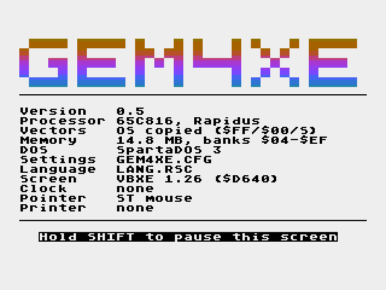

# gem4xe — GEM for the Atari 8-bit

GEM — the VDI, the AES and a desktop — on an Atari XL/XE with a
**65C816 accelerator** with linear RAM (**Rapidus**, and in principle
Antonia), drawn at **640 × 240 in 16 colours** on a **VBXE**, or at
320 × 192 on the machine's own ANTIC where there is none.  It is a port of
the Caldera-GPL Digital Research sources by way of
[EmuTOS](https://emutos.sourceforge.io/), and runs ST GEM programs ported
with its application kit: [QED](https://github.com/slaapliedje/qed-gem4xe),
the ST text editor, is one.

Current version **0.9.4** — `VERSION` at the top of the tree.

The desktop opens, copies, moves, renames and deletes, runs programs and
comes back, prints, and remembers its layout; there are desk accessories
(a control panel, a calculator, a clock), a choice of the flat look or the
Falcon's 3D one, and colour icons.  [**How to try it**](docs/guide.md) has
the machine it needs, every medium it comes on — a cartridge image is the
quickest — the emulator settings, and what works and what does not.

The desktop first came up on a real board on 2026-09-13 — a 130XE with a
Rapidus, an Ultimate 1MB, a VBXE and a SIDE 2 — after two reports that did
not get there (`docs/phase39.md`, `docs/phase40.md`).  For a machine that
does not start, `make diag` builds `GEMDIAG.COM`: `GEM.COM` with a digit and
a tone per start-up step, and OPTION/SELECT/START to skip and single-step.

## Pictures

The product booted and used, photographed under AltirraSDL by `make shots`
(`tests/emu/shots.py`, which reads its coordinates out of the running
desktop's own object trees). Every picture is 640 × 480: the 640 × 240
overlay with its rows doubled, which is what a monitor shows.

The rest are in [`docs/shots/`](docs/shots/): the bare desk, the Desk and
File menus, the About box, a folder in icon and text view, Show Info, and
the three desk accessories — the control panel, the calculator and the
clock — each open over a window. Two of them are taken from *inside* the
control panel, which is the point of the shape: the panel lists what the
AES loaded and calls a module's entry, so what is photographed is a
dialog belonging to a separately linked file the panel has never heard
of — one a settings CPX, one an event CPX being fed events by a host
that owns the loop.

## Documentation

| | |
|---|---|
| [**How to try it**](docs/guide.md) | the machine it needs, the media, the emulator, what works, where your settings are -- the release's own page |
| [**Developing**](docs/developing.md) | the tool chains, building, testing, how the tree is laid out and kept honest, and releasing |
| [**What it serves**](docs/api.md) | every AES and VDI opcode, the window fields, `appl_getinfo`, `objc_sysvar` and GEMDOS, read from the dispatchers |
| [**Where it differs**](docs/differences.md) | from an Atari ST and from EmuTOS: what a program or a person coming from one needs to know |
| [**Writing a program**](tools/sdk/README.md) | the application kit |
| [**Gates and history**](docs/gates.md) | every gate and what it proves, and how the system got here |
| [**Phase notes**](docs/README.md) | one note per piece of work, with the bugs and what caught them |

## Why it is shaped the way it is

VBXE sits on the 1.79 MHz chip bus no matter how fast the CPU runs. Measured on
target, a full-screen fill costs 0.51 of a frame through the blitter and a
full-screen copy 0.88; the same work through the MEMAC window is roughly twenty
times slower. So **the VDI emits blitter control blocks, it does not plot
pixels**, and the window manager will use dirty rectangles rather than
full-screen repaints.

## Licence

GPLv2 or later — see `COPYING` — except **the application kit, which is
LGPL-2.1-or-later** (`COPYING.LIB`), so a program built with it is its
author's to license, and the kit's examples, which are 0BSD.  **`docs/licence.md` has the position in
full**, including the one thing still outstanding. The lineage is EmuTOS, which
*is* the Caldera-GPL'd Digital Research GEM source carried forward in C, so the
licence is inherited rather than chosen.

It is v2-or-later throughout, including the AES, and the reason is in GPLv2
itself rather than in an assumption: EmuTOS's `vdi/*.c` say "version 2 or at
your option any later version", its `aes/*.c` name no version at all, and
section 9 says that when a program *does not* specify a version "you may choose
any version ever published by the Free Software Foundation". Silence is the
recipient's choice, not a v2-only grant.

No Apache-2.0 object is linked — `src/sys/clib.c` supplies the eight ISO C
functions Calypsi took from NuttX — and the **826 bytes of GEM.COM, 0.8% of it,
that is the compiler's own runtime** falls under the GPL's System Library
carve-out for "a compiler used to produce the work" (GPLv3 §1; GPLv2 §3 more
loosely), so the binaries are wholly distributable as they stand. Calypsi's own
licence expressly permits "producing application software for vintage and
retro computing systems". `tests/host/test_licence.py` reads the linker maps
and fails if the Apache-2.0 half regresses or the runtime set grows.

Where a file follows EmuTOS, its header names the donor file it follows, and
the two trees are read side by side deliberately — this is a port, not a clean
room. Two provenance rules hold everywhere else:

- **The Atari Corp VDI/AES corpus is a specification only.** It settles what a
  real ROM does; no line of it appears here.
- **Nothing that is not ours to give is in the tree.** No ROM images, no disk
  images, no firmware: the disk images are the user's own (`fixtures.toml`),
  and the Altirra patches in `tools/altirra/` are diffs against a GPLv2
  project that are also filed upstream. What *is* here from elsewhere is
  GPL'd and says so in its own header: the GEM 8×8 font and the standard fill
  patterns, extracted from EmuTOS by `tools/fontconv.py` and
  `tools/patconv.py` and checked in — so the host reference reads the same
  bytes the target links, and an EmuTOS checkout is needed only to regenerate
  them.
